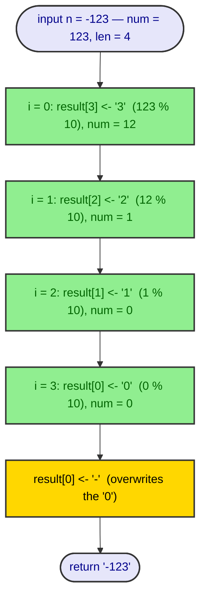
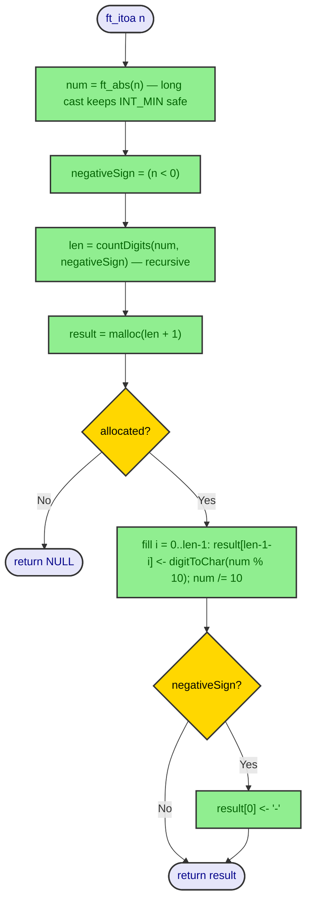

# ft_itoa

> Sources: 42 school libft subject v19.3, 2026-09-28
> Raw: [libft-subject](../../raw/project-overview/libft-subject.md)
> Updated: 2026-10-05

## Overview

`ft_itoa` allocates memory (using `malloc(3)`) and returns a string representing the integer received as an argument. Negative numbers must be handled. Prototype: `char *ft_itoa(int n)`.

## Parameters

- **n** — The integer to convert.

## Return value

The string representing the integer. NULL if the allocation fails.

## Implementation

Status: **implemented** in `ft_itoa.c`.

The conversion is done in four stages: absolute-value normalisation, recursive digit counting, buffer allocation, and right-to-left digit fill. No Part 1 functions are used — only a direct `malloc`, which the subject allows for this function.

### Stage 1 — Normalise sign

`ft_abs(int n)` casts to `long` *before* negating, so `INT_MIN` (-2147483648) does not overflow. The caller records whether the original `n` was negative in `negativeSign`.

### Stage 2 — Count digits

`countDigits(long num, int negativeSign)` recursively divides by 10 until `num < 10`, then adds 1 if a minus sign will be needed. The recursion depth equals the number of digits.

```mermaid
flowchart LR
    A["countDigits(123, 1)"] -->|"123 >= 10 — 1 + recurse"| B["countDigits(12, 1)"]
    B -->|"12 >= 10 — 1 + recurse"| C["countDigits(1, 1)"]
    C -->|"1 < 10 — base case, sign -> return 2"| D["unwind: 1 + 1 + 2 = 4"]

    classDef frame fill:#87CEEB,stroke:#333,stroke-width:2px,color:darkblue
    classDef base fill:#FFD700,stroke:#333,stroke-width:2px,color:black
    classDef result fill:#90EE90,stroke:#333,stroke-width:2px,color:darkgreen

    class A,B frame
    class C base
    class D result
```

### Stage 3 — Allocate

`malloc(len + 1)` — the `+1` covers the null terminator (`NULL_CHAR`). If allocation fails, NULL is returned immediately.

### Stage 4 — Fill digits right-to-left

The loop writes `digitToChar(num % 10)` starting at `result[len - 1]` and moving left, dividing `num` by 10 each iteration. After the loop, if the number was negative, `result[0]` is overwritten with `'-'`.

### Full flow

### Helper: digitToChar

A lookup table `"0123456789"` maps `digit` to its ASCII character. Out-of-range digits return `'\0'`.

## Edge cases

| Input | num | negativeSign | len | Output |
|-------|-----|--------------|-----|--------|
| `0` | `0` | `0` | `1` | `"0"` |
| `INT_MIN` | `2147483648L` | `1` | `11` | `"-2147483648"` |
| `INT_MAX` | `2147483647L` | `0` | `10` | `"2147483647"` |
| `-1` | `1` | `1` | `2` | `"-1"` |

## See Also

- [ft_substr](ft-substr.md), [ft_strjoin](ft-strjoin.md) — sibling allocation-based string builders
- [ft_putnbr_fd](ft-putnbr-fd.md) — file-descriptor integer output (no allocation)
