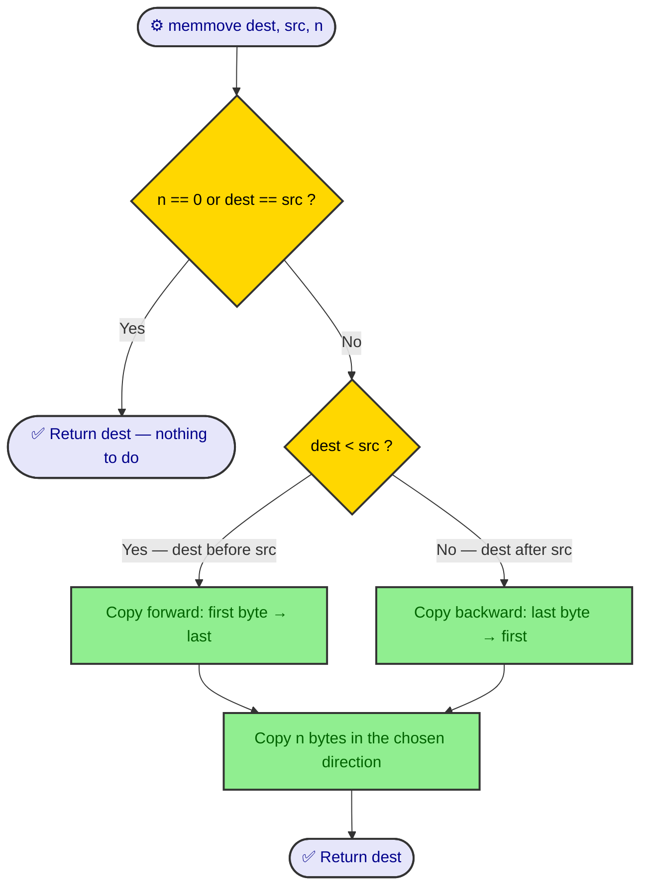
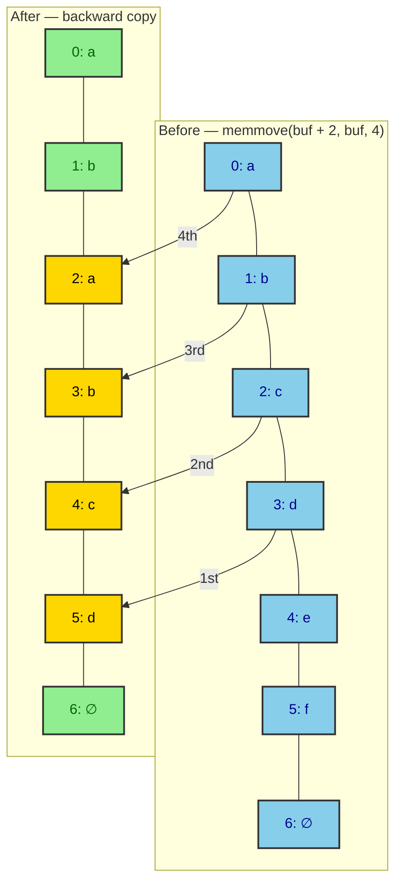
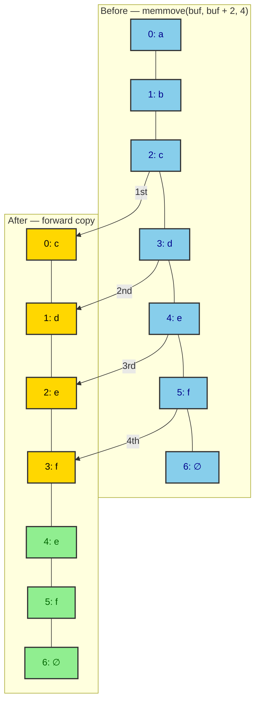
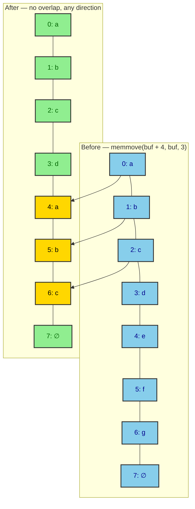
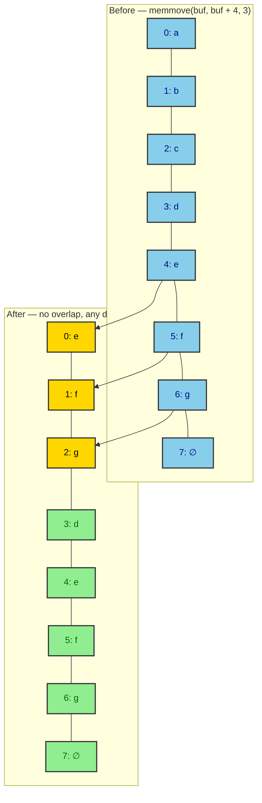

# memmove

> Sources: Michael Kerrisk, 2026-08-14
> Raw: ../../raw/string-functions/2026-08-10-memmove-3.md
> Updated: 2026-09-28

## Overview

The `memmove()` function copies `n` bytes from one memory area to another, correctly handling overlapping memory areas. It is part of the Standard C library (`<string.h>`) and is thread-safe.

## Description

`memmove()` is similar to `memcpy()`, but the memory areas may overlap. The function is standardized in C11 and POSIX.1-2008, with historical roots in C89, SVr4, and 4.3BSD.

Key points:
- Copies `n` bytes from `src` to `dest`
- Memory areas may overlap (unlike `memcpy`)
- Returns a pointer to `dest`
- Thread-safe (MT-Safe)
- Part of the Standard C library (`libc`, `-lc`)
- Includes `<string.h>`
- Preferred over `memcpy()` when overlap is possible

## Overlap handling

`memmove()` picks its copy direction from the relative positions of `dest` and `src`, so that no source byte is overwritten before it has been read:

- **`dest < src`** (destination at a lower address): copy **forward**, from the first byte. Each write lands at a lower address than the bytes still to be read.
- **`dest > src`** (destination at a higher address): copy **backward**, from the last byte. Each write lands at a higher address than the bytes still to be read.
- **`dest == src` or `n == 0`**: nothing to do; return `dest`.



## Overlapping examples

**Case 1 — `dest` after `src` (shift right), copied backward:**

```c
char buf[] = "abcdef";
memmove(buf + 2, buf, 4);
/* buf is now "ababcd" */
```



Backward copy: `buf[5]=buf[3]='d'`, `buf[4]=buf[2]='c'`, `buf[3]=buf[1]='b'`, `buf[2]=buf[0]='a'`. A forward copy here would clobber live source bytes and yield `"ababab"` instead.

**Case 2 — `dest` before `src` (shift left), copied forward:**

```c
char buf[] = "abcdef";
memmove(buf, buf + 2, 4);
/* buf is now "cdefef" */
```



Forward copy: `buf[0]=buf[2]='c'`, `buf[1]=buf[3]='d'`, `buf[2]=buf[4]='e'`, `buf[3]=buf[5]='f'`.

**Case 3 — identical pointers (no-op):**

```c
char buf[] = "abcdef";
memmove(buf, buf, 4);
/* buf is unchanged: "abcdef" */
```

## Non-overlapping examples

When the regions do not overlap, no source byte can be overwritten before it is read, so the copy direction is irrelevant.

**Case 4 — `dest` after `src` with a gap:**

```c
char buf[] = "abcdefg";
memmove(buf + 4, buf, 3);
/* buf is now "abcdabc" */
```



**Case 5 — `dest` before `src` with a gap:**

```c
char buf[] = "abcdefg";
memmove(buf, buf + 4, 3);
/* buf is now "efgdefg" */
```



**Case 6 — `n == 0`:** nothing is copied; `dest` is returned unchanged.
